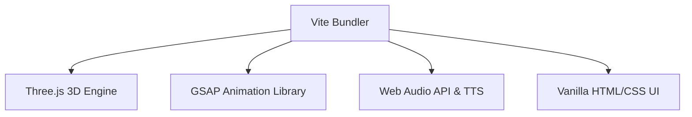

# Tech Stack Guide &mdash; The Biblical Experience Engine

This guide details the core technologies used to build the Biblical Experience Engine, explaining their implementation and role in bringing the scriptural narratives to life.

---

## 🛠️ Core Technology Stack

---

### 1. **Vite (Project Bundler & Dev Server)**
* **Role**: Serves as the ultra-fast development server and production bundler.
* **How it is used**:
  * Hot Module Replacement (HMR) allows instant feedback when tweaking Three.js coordinates or scene parameters.
  * Rollup configures the production bundle (`dist/`), outputting minified JS/CSS assets while optimizing library imports.

### 2. **Three.js (WebGL 3D Rendering)**
* **Role**: Renders the interactable 3D environments, low-poly terrains, elements, and characters.
* **How it is used**:
  * **Scenes**: `CreationScene`, `EdenScene`, and `CainAbelScene` inherit coordinate maps and update methods.
  * **Lighting**: DirectionalLights produce real-time soft shadow-mapping (`THREE.PCFSoftShadowMap`). HemisphereLights provide ambient outdoor fill.
  * **Terrain**: Dynamic vertex displacement on flat planes utilizing trigonometric equations (`Math.sin` / `Math.cos`) to generate procedural valleys, fields, and hills.
  * **Meshes**: Built entirely using Three.js primitives (`SphereGeometry`, `CylinderGeometry`, `BoxGeometry`) styled with standard materials (`MeshStandardMaterial`) to achieve a cohesive, beautiful low-poly look.
  * **Physics/Collisions**: Distance-based circle-to-circle collision bounding detection blocks player movement when colliding with scene obstacles (trees, altars, fences).

### 3. **GSAP (GreenSock Animation Platform)**
* **Role**: Coordinates complex cinematic sequences, camera pans, and mesh animations.
* **How it is used**:
  * Animates the camera's position and look-at targets smoothly during scripted story transitions.
  * Controls the scale/intensity of the sacrifice light pillars and the fade-in of Cain's mark.
  * Animates character orientations and skeletal transitions (e.g. falling to knees, dropping arms, falling flat).

### 4. **Web Audio API (Procedural Environment Audio)**
* **Role**: Generates real-time, low-level atmospheric winds and nature sounds.
* **How it is used**:
  * Procedurally synthesizes a wind sound by passing white noise through a dynamic `BiquadFilterNode` (lowpass).
  * Automatically shifts frequency cutoffs to simulate gusty wind speeds when scenes change.

### 5. **Web Speech API (Text-To-Speech Narrations)**
* **Role**: Reads scripture narrations and character dialogues using dynamic voice outputs.
* **How it is used**:
  * Uses the browser's native `window.speechSynthesis` interface.
  * Configures distinct parameters (e.g., lower pitch and slower rate for God's voice, female voice for Eve, separate voices for Cain, Abel, and the Narrator).
  * Integrates with HTML speech bubbles mapped dynamically to 2D screen positions of 3D characters.

### 6. **Vanilla CSS (Interlocking Gear Animations & Glassmorphism)**
* **Role**: Powers the UI frame, timeline overlays, and load screens.
* **How it is used**:
  * **Gears**: Standard CSS keyframe animations rotate multiple SVGs (`spin-clockwise` and `spin-counter`) to emulate interlocking gear ratios.
  * **Start/Load Screens**: Radial gradients paired with `backdrop-filter: blur()` and transparent border configurations create beautiful glassmorphic structures.
